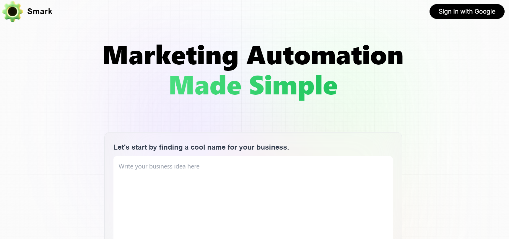
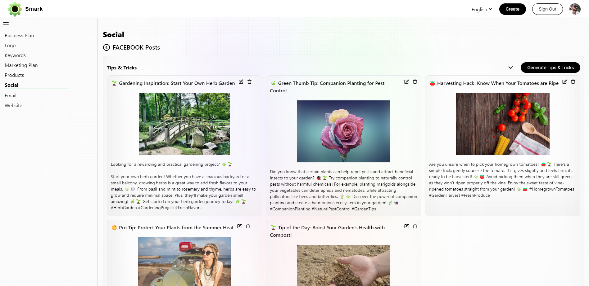

# Marketing Automation Project

We designed this project as a Data Science and Generative AI showcase.
The goal of the project was to build a tool to assist startups and small businesses in crafting 
business and marketing plans, as well as generating compelling marketing content. 

Visit [https://smark-frontend.vercel.app/](https://smark-frontend.vercel.app/) to access the Marketing Automation frontend
and unleash the power of AI-driven marketing.

## Access the project
- [Try the free online tool](https://smark-frontend.vercel.app/)
- [Python notebook](marketing_automation.ipynb) (Explore our though process and code)
- [Explore a sample output GPT3.5 VS GPT4](../gpt%20version%20differences.md)

### Features

Our Marketing Automation Project offers a wide range of functionalities to streamline and simplify the marketing process, 
which includes but is not limited to:

- Business Plan Generation
- Marketing Plan Generation
- Website Generation
- Products' Landing Page Generation
- Blog Articles Generation
- Social Media Post Generation
- Social Media Ads Generation
- Email Marketing Generation

### Technologies Used

- OpenAI API: We harness the power of GPT-3.5-turbo and GPT-4 for content generation, ensuring high-quality and relevant results
- AWS RDS PostgreSQL: All data, except images, is securely stored in an PostgreSQL database
- AWS S3: Images and multimedia files are stored in Amazon S3
- FastAPI: The backend API is built using FastAPI
- NextJS and JavaScript: The frontend is built using Next.js on Vercel

### Next Steps

We implemented another module (still in development) to automatically publish posts.

You can see some of the results on our test social media accounts:
- [Facebook](https://www.facebook.com/smartstartmktg)
- [Instagram](https://www.instagram.com/smartstart.marketing)
- [Twitter](https://twitter.com/SmartStart_Mktg)

We also implemented another module (still in development) to automatically create and publish Shorts videos.

You can see some of the results on our test social media accounts:
- [Facebook](https://www.facebook.com/financialbites)
- [Instagram](https://www.instagram.com/financialbites_tv)
- [Twitter](https://twitter.com/FinancialBites_)
- [Youtube](https://www.youtube.com/@FinancialBites-vd9bt)

## Contact
For any inquiries or feedback, please reach out to our team at [blacklionsrl.italia@gmail.com](mailto://blacklionsrl.italia@gmail.com)